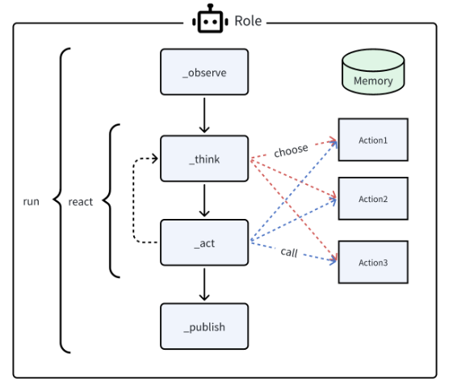
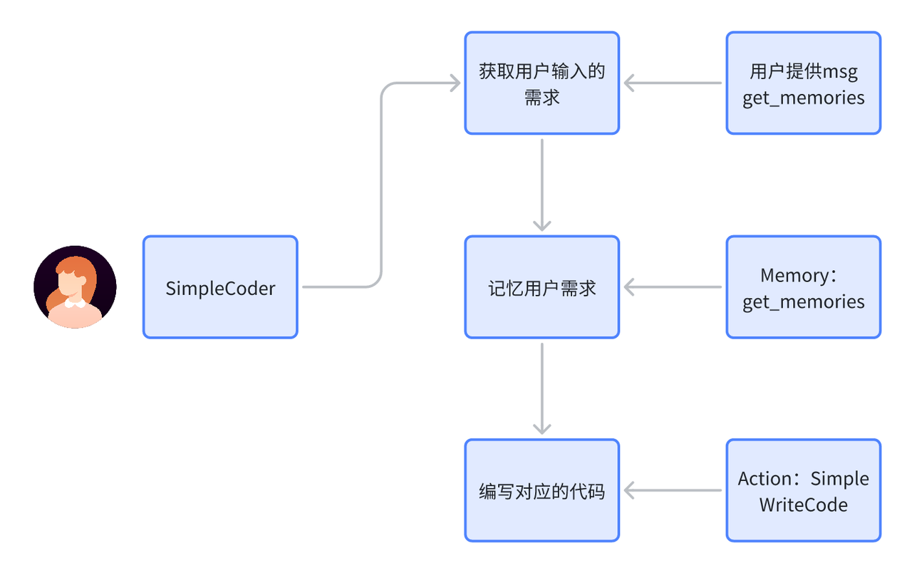

---
title : MetaGPT组件介绍以及快速上手
tags : python,LLM,Agent
---  

## 获取MetaGPT
本章节内我们将详细介绍如何获取MetaGPT  
MetaGPT提供了几种安装的方式，我们可以根据自己的需求来选择安装的方式  
请确保你的系统已安装Python 3.9+。你可以通过以下命令进行检查：
```shell
python3 --version
```
- 使用pip获取MetaGPT  
  
  metagpt可以直接用 pip 来获取至本地环境中，这样我们就可以在像使用任何python包一样导入MetaGPT  
  
  通过在终端内运行下面的代码来获取稳定版metagpt  
  
  ```shell
  pip install metagpt
  ```
  
  通过在终端内运行下面的代码来获取最新版metagpt来体验最新功能
  
  ```shell
  pip install git+https://github.com/geekan/MetaGPT
  ```
- 通过github仓库获取MetaGPT  
  
  通过仓库直接拉取MetaGPT的好处是你可以更加灵活的使用MetaGPT框架，根据MetaGPT提供的基础组件来做出更符合自己需求的Agent
  
  通过在终端内运行下面的代码从MetaGPT仓库获取MetaGPT
  ```shell
  git clone https://github.com/geekan/MetaGPT.git
  cd /your/path/to/MetaGPT
  pip install -e .
  ```
  
  
获取MetaGPT的内容就到这里为止，但MetaGPT官方还提供了更多的获取方式，包括使用Docker，以及获取可生成图表的更完整的版本，更多内容你都可以在MetaGPT的官方文档中获取  

https://docs.deepwisdom.ai/zhcn/guide/get_started/installation.html#%E5%AE%89%E8%A3%85%E5%85%A8%E9%83%A8%E5%8A%9F%E8%83%BD  

## 配置MetaGPT
完成MetaGPT后，我们还需要完成一些配置才能开始使用这个强力的框架，包括配置你自己的APIkey等等，下面我们我们将以配置ChatGPT与配置讯飞星火大模型两种案例来快速帮助大家上手配置
### 1. 调用 ChatGPT API 服务    

与我们在 chatgpt 官网使用的所见即所得的 chat 功能不同，在使用metagpt时我们需要确保自己能够使用 openai的 api 服务，OpenAI API 服务是付费的，每一个开发者都需要首先获取并配置 OpenAI API Key，才能在自己构建的应用中访问 ChatGPT。我们将在这部分讲述如何获取并配置 OpenAI API Key。  
   
#### 1.1 获取 OpenAI API Key  
   
在获取OpenAI API key之前我们需要openai官网中注册一个账号。这里假设我们已经有了openai账号，先在openai官网登录，登录后选择API，然后点击右上角的头像，选择View API keys，如下图所示：
点击Create new secret key按钮创建OpenAI API key，我们将创建好的OpenAI API key复制下来。  

#### 1.2 配置 OpenAI API Key  


MetaGPT提供两种种配置OpenAI API key的方法，你可以将自己的OpenAI API key保存为环境变量，这样在你本地网络通畅的情况下（请确保你能够访问到openai）就可以直接使用OpenAI服务
在命令行下执行：  
```shell
export OPENAI_API_KEY="sk-..."  填入你自己的OpenAI API key
export OPENAI_API_MODEL="intended model" 选择你要使用的模型，例如：gpt-4, gpt-3.5-turbo
```
当如上配置后依然访问不通时，您可以尝试再添加一行命令
```shell
export OPENAI_API_KEY="sk-..."  填入你自己的OpenAI API key
export OPENAI_API_MODEL="intended model" 选择你要使用的模型，例如：gpt-4, gpt-3.5-turbo
export OPENAI_API_BASE="https://api.openai-forward.com/v1"
```  

同样你可以在代码中使用os库来将自己的OpenAI API key设定为环境变量来使用OpenAI API 服务  

```shell
import os
os.environ["OPENAI_API_KEY"] = "sk-..."  # 填入你自己的OpenAI API key
os.environ["OPENAI_API_MODEL"] = "intended model" # 选择你要使用的模型，例如：gpt-4, gpt-3.5-turbo
os.environ["OPENAI_API_BASE"] = "https://api.openai-forward.com/v1"
```
同时MetaGPT还提供了利用config.yaml文件来配置OpenAI API服务的方法  

1. 在当前项目的工作目录下，新建一个文件夹config并在该文件夹下添加一个config.yaml或key.yaml文件

2. 拷贝样例配置 config.yaml 中的内容到你的新文件中。
3. 在新文件内设置自己的OPENAI API KEY配置：  


```yaml
OPENAI_API_KEY:"sk-..." # YOUR_API_KEYOPENAI_API_MODEL:"intended model" # gpt-4, gpt-3.5-turbo, etc.
```
记住：如果你按照通过github仓库获取MetaGPT，config/config.yaml已经存在于目录中。只需要直接进行配置，或拷贝一个新文件 config/key.yaml 并进行配置。 这样你就不会因为不小心提交了API KEYT而导致泄露。  

> MetaGPT将会按照下述优先级来读取你的配置：config/key.yaml > config/config.yaml > environment variable  


## MetaGPT框架组件教程
### 1. Agent组件介绍 
#### 1.1 Agent概念概述
在MetaGPT看来，我们把Agent想象成环境中的数字人，其中
Agent = 大语言模型（LLM） + 观察 + 思考 + 行动 + 记忆
这个公式概括了智能体的功能本质。为了理解每个组成部分，让我们将其与人类进行类比：
1. 大语言模型（LLM）：LLM作为智能体的“大脑”部分，使其能够处理信息，从交互中学习，做出决策并执行行动。
2. 观察：这是智能体的感知机制，使其能够感知其环境。智能体可能会接收来自另一个智能体的文本消息、来自监视摄像头的视觉数据或来自客户服务录音的音频等一系列信号。这些观察构成了所有后续行动的基础。
3. 思考：思考过程涉及分析观察结果和记忆内容并考虑可能的行动。这是智能体内部的决策过程，其可能由LLM进行驱动。
4. 行动：这些是智能体对其思考和观察的显式响应。行动可以是利用 LLM 生成代码，或是手动预定义的操作，如阅读本地文件。此外，智能体还可以执行使用工具的操作，智能体还可以执行使用工具的操作，包括在互联网上搜索天气，使用计算器进行数学计算等。
5. 记忆：智能体的记忆存储过去的经验。这对学习至关重要，因为它允许智能体参考先前的结果并据此调整未来的行动。

在MetaGPT中定义的一个agent运行示例如下：  
  

- 一个agent在启动后他会观察自己能获取到的信息，加入自己的记忆中
- 下一步进行思考，决定下一步的行动，也就是从Action1，Action2，Action3中选择执行的Action
- 决定行动后，紧接着就执行对应行动，得到这个环节的结果  
 
而在MetaGPT内 Role 类是智能体的逻辑抽象。一个 Role 能执行特定的 Action，拥有记忆、思考并采用各种策略行动。基本上，它充当一个将所有这些组件联系在一起的凝聚实体。目前，让我们只关注一个执行动作的智能体，并看看如何实现一个最简单的 Agent  

#### 1.2 实现一个单动作Agent  

下面将带领大家利用MetaGPT框架实现一个生成代码的Agent SimpleCoder 我们希望这个Agent 能够根据我们的需求来生成代码
要自己实现一个最简单的Role，只需要重写Role基类的 _init_ 与 _act 方法  

在 _init_ 方法中，我们需要声明 Agent 的name（名称）profile（类型）  

我们使用 self._init_action 函数为其配备期望的动作   SimpleWriteCode 这个Action 应该能根据我们的需求生成我们期望的代码  

再_act方法中，我们需要编写智能体具体的行动逻辑，智能体将从最新的记忆中获取人类指令，运行配备的动作，MetaGPT将其作为待办事项 (self._rc.todo) 在幕后处理，最后返回一个完整的消息。  

##### 1.2.1 需求分析
要实现一个 SimpleCoder 我们需要分析这个Agent 它需要哪些能力  



首先我们需要让他接受用户的输入的需求，并记忆我们的需求，接着这个Agent它需要根据自己已知的信息和需求来编写我们需要的代码。  

##### 1.2.2 编写SimpleWriteCode动作  

在 MetaGPT 中，类 Action 是动作的逻辑抽象。用户可以通过简单地调用 self._aask 函数令 LLM 赋予这个动作能力，即这个函数将在底层调用 LLM api。  

下面是实现SimpleWriteCode的具体代码： 

```python
from metagpt.actions import Action

class SimpleWriteCode(Action):

    PROMPT_TEMPLATE = """
    Write a python function that can {instruction} and provide two runnnable test cases.
    Return ```python your_code_here ``` with NO other texts,
    your code:
    """

    def __init__(self, name="SimpleWriteCode", context=None, llm=None):
        super().__init__(name, context, llm)

    async def run(self, instruction: str):

        prompt = self.PROMPT_TEMPLATE.format(instruction=instruction)

        rsp = await self._aask(prompt)

        code_text = SimpleWriteCode.parse_code(rsp)

        return code_text

    @staticmethod
    def parse_code(rsp):
        pattern = r'```python(.*)```'
        match = re.search(pattern, rsp, re.DOTALL)
        code_text = match.group(1) if match else rsp
        return code_text
```

在我们的场景中，我们定义了一个 SimpleWriteCode 类，它继承自 Action类，我们重写了__init__方法与 run 方法  

__init__ 方法用来初始化这个Action，而run方法决定了我们对传入的内容到底要做什么样的处理    

在__init__方法中，我们声明了这个类要使用的llm，这个动作的名称，以及行动前的一些前置知识（context），这里context为空  

```python
def __init__(self, name="SimpleWriteCode", context=None, llm=None):
        super().__init__(name, context, llm)
```   

在run方法中，我们需要声明当采取这个行动时，我们要对传入的内容做什么样的处理  

在 SimpleWriteCode 类中，我们应该传入：“请你帮我写一个XXX的代码” 这样的字符串，也就是用户的输入，run方法需要对它进行处理，把他交给llm，等到llm返回生成结果后，我们再取出其中的代码部分返回。  

我们写好了一个提示词模板，将用户输入嵌入模板中  

```python
PROMPT_TEMPLATE = """
    Write a python function that can {instruction} and provide two runnnable test cases.
    Return ```python your_code_here ``` with NO other texts,
    your code:
    """
prompt = self.PROMPT_TEMPLATE.format(instruction=instruction)
```  

接着我们让大模型为我们生成回答  
```python
rsp = await self._aask(prompt)  
```

生成回答后，我们利用正则表达式提取其中的code部分，llm在返回给我们代码时通常用下面的形式返回  

```python
code内容
```
对应的正则提取内容如下：  
```python
@staticmethod
def parse_code(rsp):
    pattern = r'```python(.*)```'
    match = re.search(pattern, rsp, re.DOTALL)
    code_text = match.group(1) if match else rsp
    return code_text
```

最后将代码内容返回  

至此我们就完成了这样一个编写代码的动作。  

##### 1.2.3 设计SimpleCoder角色  

在编写完SimpleWriteCode动作后，我相信大家还有很多疑惑，比如如何调用这个动作？怎样把用户输入的内容传递给这个动作？  

这部分内容我们都会在设计SimpleCoder角色的时候解决  

```python
class SimpleCoder(Role):
    def __init__(
        self,
        name: str = "Alice",
        profile: str = "SimpleCoder",
        **kwargs,
    ):
        super().__init__(name, profile, **kwargs)
        self._init_actions([SimpleWriteCode])

    async def _act(self) -> Message:
        logger.info(f"{self._setting}: ready to {self._rc.todo}")
        todo = self._rc.todo # todo will be SimpleWriteCode()

        msg = self.get_memories(k=1)[0] # find the most recent messages

        code_text = await todo.run(msg.content)
        msg = Message(content=code_text, role=self.profile, cause_by=type(todo))

        return msg
```

前面我们已经提到过实现一个最简单的Role，只需要重写Role基类的 _init_ 与 _act 方法  

__init__ 方法用来初始化这个Action，而_act方法决定了当这个角色行动时它的具体行动逻辑  

我们在__init__ 方法中声明了这个Role的name（昵称），profile（人设），以及我们为他配备了我们之前写好的动作  **SimpleWriteCode**  

```python
def __init__(
        self,
        name: str = "Alice",
        profile: str = "SimpleCoder",
        **kwargs,
    ):
        super().__init__(name, profile, **kwargs)
        self._init_actions([SimpleWriteCode])
```  

配备好之后，我们定义的行动SimpleWriteCode就会被加入到代办self._rc.todo中，  

在_act方法中，我们就会要求我们的智能体来执行这个动作，也就是我们需要调用todo.run()方法  

```python
async def _act(self) -> Message:
    logger.info(f"{self._setting}: ready to {self._rc.todo}")
    todo = self._rc.todo  # todo will be SimpleWriteCode()
```  

另外我们在 前面的action 中提到了，当action调用时，我们需要获取用户的输入来作为instruction传递给action，这里就涉及到我们该如何获取用户之前传递给agent的信息，在MetaGPT中，当用户与Agent交互时，所有的内容都会被存储在其自有的Memory中  

在MetaGPT中，Memory类是智能体的记忆的抽象。当初始化时，Role初始化一个Memory对象作为self._rc.memory属性，它将在之后的_observe中存储每个Message，以便后续的检索。简而言之，Role的记忆是一个含有Message的列表。  

当需要获取记忆时（获取LLM输入的上下文），我们可以使用self.get_memories。函数定义如下：  

```python
def get_memories(self, k=0) -> list[Message]:
    """A wrapper to return the most recent k memories of this role, return all when k=0"""
    return self._rc.memory.get(k=k)
```  

在SimpleCoder中，我们只需要获取最近的一条记忆，也就是用户下达的需求，将它传递给action即可  

```python
msg = self.get_memories(k=1)[0]  # find the most recent messages
code_text = await todo.run(msg.content)  
```

然后我们就将拿到大模型给我们的输出啦，最后我们将拿到的信息封装为MetaGPT中通信的基本格式 Message 返回，

MetaGPT Message解析：

这样，我们就实现了一个简单的单动作Agent  

##### 1.2.3 运行SimpleCoder角色  

接下来你只需要初始化它并使用一个起始消息运行它。  

```python
import asyncio

async def main():
    msg = "write a function that calculates the sum of a list"
    role = SimpleCoder()
    logger.info(msg)
    result = await role.run(msg)
    logger.info(result)

asyncio.run(main)
```