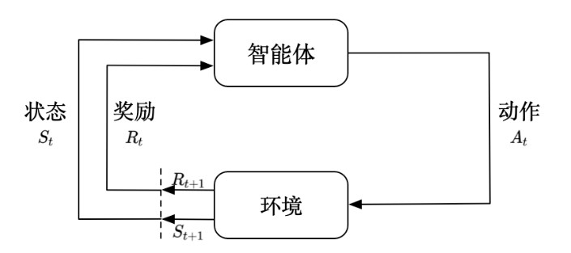
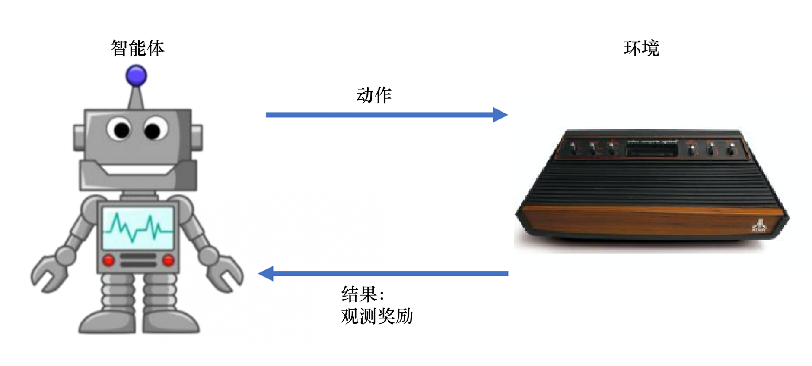

# RL笔记
## 一、强化学习基础
### 1.1 强化学习概述

<figure style="text-align: center">

<figcaption>图1.1 强化学习示意图</figcaption>
</figure>

智能体通过获取环境状态$S_t$，采取一个动作$A_t$，环境在这个动作Action(策略 Policy)的影响下进入到下一个状态$S_{t+1}$，并且返回给智能体动作$A_t$所带来的奖励$R_t$。

### 1.2 序列决策

<figure style="text-align: center">

<figcaption>图1.2 智能体和环境</figcaption>
</figure>

#### 1.2.1 奖励

奖励是环境反馈给智能体的一种标量(scalar)信号，能够衡量在某个状态$S_t$采取某个动作$A_t$下，智能体表现得好坏。强化学习的目的就是最大化奖励，最大化智能体能够在环境中得到的期望累计奖励。

#### 1.2.3 序列决策

在智能体与环境交互的过程中，每一种观测下，智能体都会采取一个动作，然后环境会返回给智能体一个奖励。由观测、动作、奖励组成了整个系统的历史$H_t$：
$$
H_t=o_1,a_1,r_1,...,o_t,a_t,r_t
$$

在一个强化学习环境中，经常存在的问题是奖励具有延迟性，为了最大化期望累计奖励，必须让智能体采取一些具有长期交互来说有利的动作。智能体采取动作需要依赖历史，不能只靠某个时间点的信息来做出决策，那么环境的状态$S_t$被看作是关于历史$H_t$的函数：
$$
S_t=f(H_t)
$$