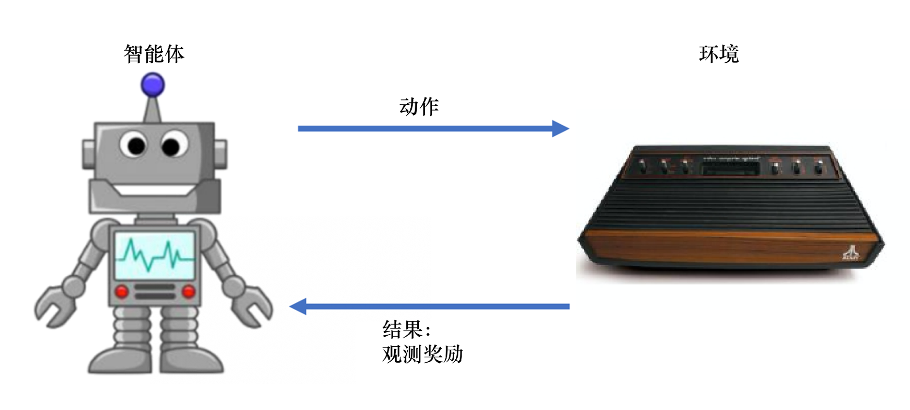

# RL笔记
## 一、强化学习基础
### 1.1 强化学习概述

<figure style="text-align: center">

<figcaption>图1.1 强化学习示意图</figcaption>
</figure>

智能体通过获取环境状态$S_t$，采取一个动作$A_t$，环境在这个动作Action(策略 Policy)的影响下进入到下一个状态$S_{t+1}$，并且返回给智能体动作$A_t$所带来的奖励$R_t$。

### 1.2 序列决策

<figure style="text-align: center">

<figcaption>图1.2 智能体和环境</figcaption>
</figure>

#### 1.2.1 奖励

奖励是环境反馈给智能体的一种标量(scalar)信号，能够衡量在某个状态$S_t$采取某个动作$A_t$下，智能体表现得好坏。强化学习的目的就是最大化奖励，最大化智能体能够在环境中得到的期望累计奖励。

#### 1.2.3 序列决策